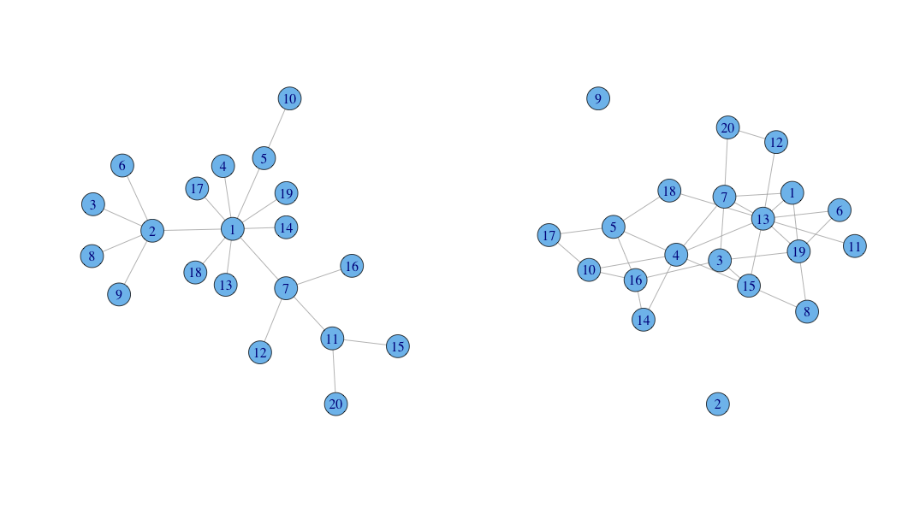

### About

Network Explorer is a simple app built as an exercise for the [Developing Data Products](https://www.coursera.org/course/devdataprod) course on Coursera. It is intended primarily as a teaching tool for exploration of the connectivity patterns in two distinct families of networks. 

- A [live version](https://ggdata.shinyapps.io/barabasi/) is hosted on the RStudio Shiny platform. 
- A [short set of slides](http://rpubs.com/ggData/barabasi) to describe this app can be found on RPubs.
- The [source code](https://github.com/ggData/barabasi) for this application is on [Github](https://github.com/ggData/barabasi). 

### Basic Concepts and Definitions

These two diagrams illustrate two different networks, each composed of 20 _nodes_, or _vertices_. Each connection between two nodes is called an _edge_. The number of neighbours connected to node _N_ is called the _degree_ of node _N_.

The two networks have been created in different ways:

1. In the graph on the left, the more connected a node is, the more likely it is to receive a connection from any new node joining the network. This creates a pattern of connections characterised by a few highly connected nodes (a few nodes of high degree), while most of the other nodes have low degree (a very small number of neighbours).
2. In the graph on the right, all edges have an equal probability of existing, i.e. any two nodes have a known probability of being connected by a common edge. This results in a pattern of more evenly distributed degree across the nodes without any nodes standing out as being highly connected.

### Using the App

Network Explorer is a simple app visualising these two styles of graph creation. It allows interactive exploration of the connectivity patterns that are generated in the two families of network. There are three choices to be made:

1. In the left hand panel, one first selects the graph type: **preferential attachment** or **random attachment**. These correspond to the left and right graph styles int he diagram above.
2. One next selects the number of nodes using a slider widget. The number of nodes is limited to between 5 and 100, allowing sufficient range to explore patterns without creating network diagrams that are completely indecipherable.
3. If one has selected the random attachment style, another slider appears where one can set the probability of attachment. This is the overall probability that any two nodes in the network will be connected.

Any choices made in the left hand panel result immediately in a change in the output on the right hand panel. This panel has two exploration tabs, entitled "Network" and "Degree Distribution":

- The **Network** tab displays a ball-and-stick diagram of the resulting network. It also displays a few numerical indices: the _average path length_ is the average number of edges that lie between nodes in connected clusters (commonly known as the "degrees of separation"), the _number of clusters_ is the number of nodes in each group of connected nodes, and the _graph density_ is the ratio of the number of actual edges to the number of all possible edges between nodes.
- The **Degree Distribution** tab displays a relative distribution chart showing the proportion of nodes having a given number of neighbours.

### Exploration

1. Explore the patterns of graph that result from selecting different graph types while keeping the number of nodes constant.
2. For a given number of nodes, explore the graph density differences between the two graph types
3. Selecting the random attachment graph type, explore the patterns that emerge when varying the probability while keeping a constant number of nodes or vice versa. For example, for a given probability of attachment, how many are needed before all the nodes are connected in one large group (the number of clusters becomes 1)
4. Explore the effect of all these on the degree distribution. One of the graphs has a  highly skewed degree distribution with most nodes having low degree and only a few nodes being highly connected. The other type has higher average degree and this is more evenly distributed across the nodes.

### Further Reading

1. The preferential attachment graph is built using the _Barabasi-Albert model_, "an algorithm for generating random scale-free networks" ([Barabasi-Albert page on Wikipedia](http://en.wikipedia.org/wiki/Barab%C3%A1si%E2%80%93Albert_model)). This model is often used to study the behaviour of real-world social networks where, for example, a few celebrities attract a large number of followers while most people have a much smaller number of friends/followers.
2. Random attachment graph is built using the _Erdos-Renyi model_, where graphs can be constructed either by stipulating the probability of attachment (as in this app) or by stipulating the number of edges. The [Erdos-Renyi Wikipedia page](http://en.wikipedia.org/wiki/Erd%C5%91s%E2%80%93R%C3%A9nyi_model) has more. This pattern is less likely to be observed in human social networks or in natural networks.

### Credits

- Network Explorer is a [Shiny](http://shiny.rstudio.com/) app 
- It is built with [R](http://www.r-project.org/) and  [Rstudio](http://www.rstudio.com/). 
- The [ggplot2](http://ggplot2.org/) package is used for plotting distributions.
- The [igraph](http://igraph.org/redirect.html) package is used for network creation and analysis.

----
